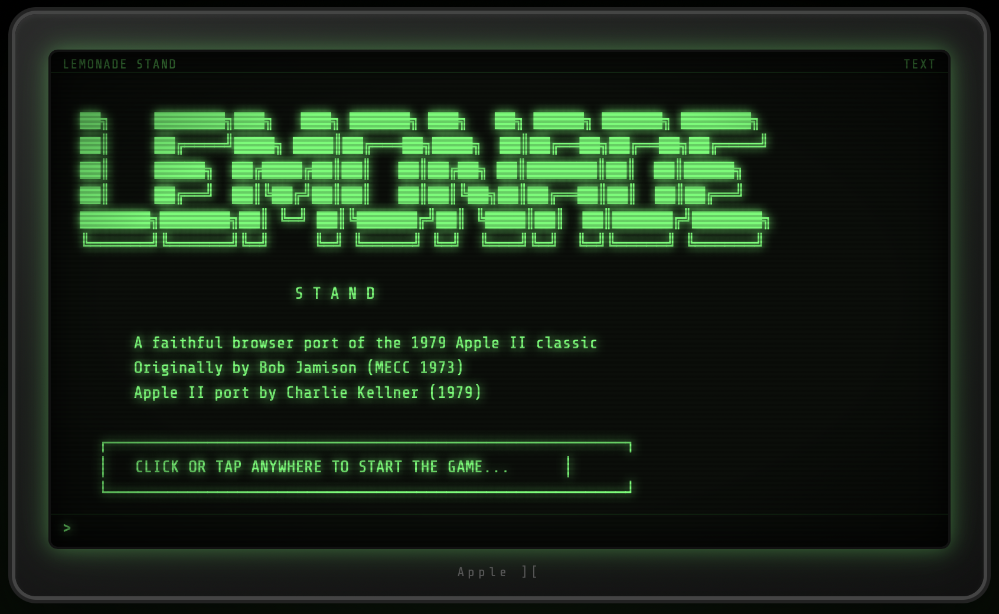

# 🍋 Apple II Lemonade Stand — Browser Port




A faithful browser port of the classic 1979 Apple II game **Lemonade Stand**, playable in any modern web browser as a single self-contained HTML file. No installation, no dependencies, no server required.

_This port was done by [Claude](claude.ai) using the Sonnet 4.6 LLM._ 

---

## 🕹️ Play It

Just open [lemonade_stand.html](lemonade_stand.html) in your browser. That's it.

- Clone or download the repo
- Double-click `lemonade_stand.html`
- Click or press any key to start

> Tested in Chrome, Firefox, Safari, and Edge.

---

## 📖 About the Original

**Lemonade Stand** is one of the earliest educational business simulation games ever written. It was originally created by **Bob Jamison** of the Minnesota Educational Computing Consortium (MECC) in 1973, and ported to the Apple II in February 1979 by **Charlie Kellner** of Apple Computer.

The game puts you in charge of a lemonade stand in the fictional town of Lemonsville, California. Each day you decide how many glasses to make, how many advertising signs to put up, and what price to charge. Weather, random events, and the laws of supply and demand determine your profits.

---

## 🎮 How to Play

Each round is **12 days**. Up to **30 players** can compete simultaneously, each managing their own stand. The player with the most assets at the end wins.

Every day you make three decisions:

| Decision | Notes |
|---|---|
| **Glasses to make** | Only one batch per morning — you can't restock |
| **Advertising signs** | Each sign costs 15¢ and boosts demand |
| **Price per glass** | Balance demand vs. profit margin |

### Costs

The cost of lemonade per glass increases as the game progresses:

| Days | Cost per glass |
|---|---|
| 1–2 | 2¢ (mum gives you free sugar 🍬) |
| 3–6 | 4¢ |
| 7+ | 5¢ |

Signs cost **15¢ each**. You can't spend more than your current assets.

### Weather

Each day opens with a weather report — this directly affects how many glasses you can sell:

| Weather | Effect |
|---|---|
| ☀️ Sunny | Normal demand |
| 🔥 Hot & Dry | Doubled demand (heat wave!) |
| ☁️ Cloudy | Reduced demand; risk of rain |
| ⛈️ Thunderstorm | Everything ruined — zero sales |

### Random Events

After day 2, surprises can happen:

- **Street Department working** — no traffic on your street; sales drop to 10% (or the crew buys all your lemonade at lunch!)
- **Light Rain** — demand reduced proportionally to rain chance
- **Heat Wave** — demand doubled
- **Thunderstorm** — wipes out all stands for the day

### Going Bankrupt

If your assets drop below the cost of a single glass of lemonade, you're declared **bankrupt** and can no longer make decisions. In a single-player game this ends the game immediately.

---

## 💻 What Was Ported

The original Applesoft BASIC source code used several Apple II-specific features that required creative translation:

### Lo-Res Graphics (GR mode)

The Apple II's **40×40 lo-res graphics grid** (16 colors) is emulated on an HTML5 `<canvas>` element using the exact Apple II color palette. The original `HLIN`, `VLIN`, and `PLOT` commands are all implemented and used to draw the weather cut-scenes: sunny skies, hot haze, cloud formations, and animated lightning bolts.

### Sound & Music (`POKE`-based speaker)

The Apple II produced sound by toggling a speaker via memory-mapped I/O — specifically `POKE 768, freq : POKE 769, duration : CALL 770`. This is emulated using the **Web Audio API** with square-wave oscillators tuned to approximate the original pitches. All four weather theme tunes play on the weather screen, along with the daily financial report chime and a noise-buffer thunderclap effect.

### CRT Aesthetic

The display mimics an Apple II green-phosphor monitor complete with:
- Phosphor green text with glow (`text-shadow`)
- CRT scanline overlay
- Screen vignette
- Monitor bezel with the **Apple ][** badge

### Text Terminal (80×24)

The Apple II text mode displayed 80 characters across 24 lines. The browser port replicates this with a monospace terminal that scrolls output and accepts keyboard input, matching the original line-by-line input/output style of the BASIC program.

---

## 🗂️ File Structure

```
lemonade_stand.html    # The entire game — one self-contained file
README.md              # This file
```

There are no external dependencies, build steps, or frameworks. The HTML file includes all JavaScript, CSS, and game logic inline.

---

## 🔧 Technical Notes

- **Language:** Vanilla JavaScript (TypeScript-style, no transpiler needed)
- **Audio:** Web Audio API — click/tap required to unlock audio context on first load (browser security requirement)
- **Graphics:** HTML5 Canvas, `image-rendering: pixelated`
- **Fonts:** [Share Tech Mono](https://fonts.google.com/specimen/Share+Tech+Mono) via Google Fonts (falls back to any monospace font if offline)
- **Browser support:** All modern browsers (Chrome 66+, Firefox 60+, Safari 12+, Edge 79+)

---

## 📜 Original Source

The original Applesoft BASIC source used in this port is available here:

[https://gist.github.com/badvision/16b74ade3a8b2fa2e87d](https://gist.github.com/badvision/16b74ade3a8b2fa2e87d)

---

## 🏛️ Credits

| Role | Person |
|---|---|
| Original game design | Bob Jamison, MECC (1973) |
| Apple II port | Charlie Kellner, Apple Computer (1979) |
| Browser port | This repository |

---

## 📄 License

This is a fan/educational port of a historical software title. The original game was published by Apple Computer, Inc. in 1979. This port is provided for educational and preservation purposes.
